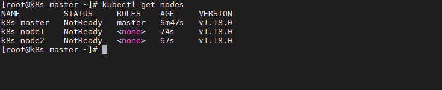
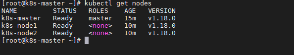

## Environment
- Ubuntu Version：18.04
- Docker: 20+
- k8s: 1.21.3

## Set hostname

Set hostname with command `hostnamectl set-hostname <hostname>`:
```bash
## set hostname on corresponding machine.
$ hostnamectl set-hostname k8s-master/k8s-nodeN
```

## System setting
Perform the operations on both the master and slave/workers nodes:  

- 关闭部分系统服务
    ```bash
    # disabling the firewall
    $ ufw disable

    # disabling the selinux
    $ sudo apt install selinux-utils
    $ setenforce 0

    # disabling the swap partition
    $ swapoff -a
    $ sudo gedit /etc/fstab ## comment out the "swap" line
    ```
- 桥接的IPV4流量传递到iptables 的链
    ```bash
    $ cat > /etc/sysctl.d/k8s.conf <<EOF
    net.bridge.bridge-nf-call-ip6tables = 1
    net.bridge.bridge-nf-call-iptables = 1
    EOF
    $ sysctl --system #生效
    ```

## K8S setting 
以下操作主从节点均需要执行：
- 安装docker:
    ```bash
    $ apt install docker.io -y
    ```
- 配置k8s资源:
    ```bash
    $ curl -s https://mirrors.aliyun.com/kubernetes/apt/doc/apt-key.gpg | sudo apt-key add -
    $ echo "deb https://mirrors.aliyun.com/kubernetes/apt/ kubernetes-xenial main" > /etc/apt/sources.list.d/kubernetes.list
    $ apt-get update
    ```
- 安装kubeadm(初始化cluster)，kubelet(启动pod)和kubectl(k8s命令工具)
    ```bash
    $ apt install -y kubelet=1.21.3-00 kubeadm=1.21.3-00 kubectl=1.21.3-00
    ```
- 设置开机启动并启动kubelet
    ```bash
    $ systemctl enable kubelet && systemctl start kubelet
    ```
以下操作需在主节点执行：
- 新建并执行k8s.sh
    ```bash
    #!/bin/bash
    images=(
    kube-apiserver:v1.21.3
    kube-controller-manager:v1.21.3
    kube-scheduler:v1.21.3
    kube-proxy:v1.21.3
    pause:3.2
    etcd:3.4.13-0
    )
    for imageName in ${images[@]} ; do
    docker pull registry.cn-hangzhou.aliyuncs.com/google_containers/${imageName}
    docker tag registry.cn-hangzhou.aliyuncs.com/google_containers/${imageName} k8s.gcr.io/${imageName}
    docker rmi registry.cn-hangzhou.aliyuncs.com/google_containers/${imageName}
    done
    docker pull coredns/coredns:1.8.0
    docker tag coredns/coredns:1.8.0 registry.aliyuncs.com/google_containers/coredns:v1.8.0
    docker rmi coredns/coredns:1.8.0
    ```
- 初始化Master
    ```bash
    $ kubeadm init --image-repository=registry.aliyuncs.com/google_containers  --pod-network-cidr=10.244.0.0/16	 --service-cidr=10.96.0.0/12
    ``` 
- 记录join并在从节点执行这句话
    ```bash
    $ kubeadm join 172.16.206.13:6443 --token 9pslv8.6tbrux0ksur0wgav --discovery-token-ca-cert-hash sha256:3709a3ce5a0ec81
    ```
    **NOTE:** 若没有记录，也可在master节点用以下操作获取：
    ```bash
    $ kubeadm token create --print-join-command
    ```
    默认的token有效期为24小时，当过期之后，该token就不能用了，这时可以使用如下的命令创建token：
    ```bash
    $ kubeadm token create --ttl 0
    ```

- 主节点配置 `kubectl`:
    ```bash
    $ mkdir -p $HOME/.kube
    $ sudo cp -i /etc/kubernetes/admin.conf $HOME/.kube/config
    $ sudo chown $(id -u):$(id -g) $HOME/.kube/config
    ```

## 部署CNI网络插件
根据提示，在Master节点使用`kubectl`工具查看节点状态：
```bash
$ kubectl get nodes
```


在Master节点部署CNI网络插件(可能会失败，如果失败，请下载到本地，然后安装)：

```bash
$ kubectl apply -f https://raw.githubusercontent.com/coreos/flannel/master/Documentation/kube-flannel.yml
```
再次在Master节点使用kubectl工具查看节点状态：
```bash
$ kubectl get nodes
```


## Fix Unhealthy status
部署完集群后，执行`kubectl get cs`命令来检测组件的运行状态时，可能会报以下错误：
```bash
$ kubectl get cs
Warning: v1 ComponentStatus is deprecated in v1.19+
NAME                 STATUS      MESSAGE                                                                                       ERROR
scheduler            Unhealthy   Get "http://127.0.0.1:10251/healthz": dial tcp 127.0.0.1:10251: connect: connection refused  
controller-manager   Unhealthy   Get "http://127.0.0.1:10252/healthz": dial tcp 127.0.0.1:10252: connect: connection refused  
etcd-0               Healthy     {"health":"true"}                                                                            
$ wget http://127.0.0.1:10251/healthz
--2020-11-14 00:10:51--  http://127.0.0.1:10251/healthz
Connecting to 127.0.0.1:10251... failed: Connection refused.
```
出现这种情况，是`/etc/kubernetes/manifests/`下的`kube-controller-manager.yaml`和`kube-scheduler.yaml`设置的默认端口是0导致的，需要用#注释掉相应文件中的`-–port=0`:
```bash
# 1. kube-controller-manager.yaml文件修改：注释掉27行
# 2. kube-scheduler.yaml配置修改：注释掉19行,- --port=0
```
在master节点重启`kubelet`:
```bash
$ systemctl restart kubelet.service
```
重新查看已正常:
```bash
$ kubectl get cs
Warning: v1 ComponentStatus is deprecated in v1.19+
NAME                 STATUS    MESSAGE             ERROR
scheduler            Healthy   ok                 
controller-manager   Healthy   ok                 
etcd-0               Healthy   {"health":"true"}  
```
