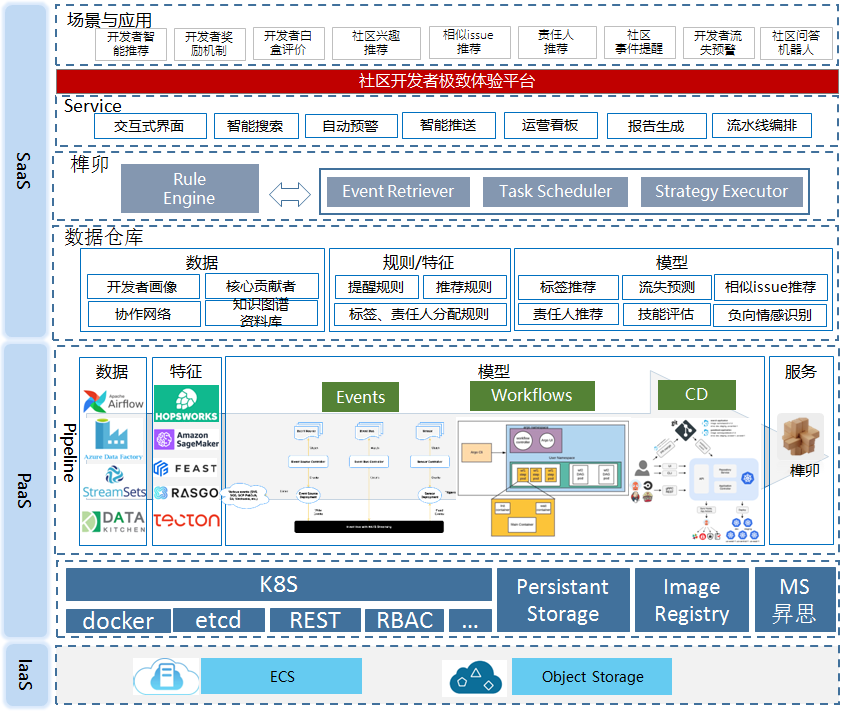

# MLops platform installation guide
Tools for building your MLops/ResearchOps workflows.
## **Workflows**

Workflows is a container-native workflow engine for orchestrating parallel jobs on Kubernetes.We build it on top of Argo Workflows, which is implemented as a Kubernetes CRD (Custom Resource Definition).

## Argo Workflow Install

You need to configure the ArgoWorkflow environment before deploy your own workflows. Fortunately, it is extremely convenient to install ArgoWorkflow based on the cloud-native k8s environment. Make sure you have `kubectl` configured correctly on your machine, use `kubectl apply` command with installation yaml file in `workflows/` folder to install Argo:

```bash
# Create specific namespace for ArgoWorkflow
$ kubectl create ns argo
# Install ArgoWorkflow
$ kubectl apply -f workflows/install.yaml -n argo
```

**Optional:** Download the latest Argo CLI from official [releases page](https://github.com/argoproj/argo-workflows/releases/latest) which includes the guide on setting up.

## Mnist Example (Optional)

### **Configure Artifact Repository**

To run Argo workflows that use artifacts, such as `Mnist` we are running, you must configure and use an artifact repository. Argo supports any S3 compatible artifact repository such as AWS, GCS ( Google Cloud Storage ) and Minio. We all used `GCS` in our examples:

1. Create a bucket and name it `mlops-example-bucket` from the GCP Console (https://console.cloud.google.com/storage/browser).  

2. Create the Service Account key and store it as a K8s secret:

    ```shell
    # Create specific namespace for Mnist Demo
    $ kubectl create ns mnist-demo
    # Create secret for GCS used by Mnist workflows
    $ kubectl create secret generic mlops-bucket-serviceaccount --from-file=serviceAccountKey=<YOUR-SERVICE-ACCOUNT-KEY-file> -n mnist-demo
    ```

### **Create Service Account for Argo Workflows**

To access cluster resources, such as pods and workflows contronller, you should create a new service account with proper authorization.

```shell
# Create Service Account for Argo Workflows
$ kubectl create -f workflows/create-serviceaccounts.yaml -n mnist-demo
```

### **Build Images**

All scripts used for Mnist model training and evaling are in the `mnist/` folder, use `docker build` command to build and tag the image:

```shell
# Build Image
$ cd workflows/examples/mnist/docker/
$ docker build -t $DOCKER_REGISTRY/$MY_ORG/mnist-example:$TAG ./
$ docker push $DOCKER_REGISTRY/$MY_ORG/mnist-example:$TAG
```

Scripts used for Mnist serving are in the `mnist-serving` folder:

```shell
# Build Image
$ cd workflows/examples/mnist-serving/docker/
$ docker build -t $DOCKER_REGISTRY/$MY_ORG/mnist-serving:$TAG ./
$ docker push $DOCKER_REGISTRY/$MY_ORG/mnist-serving:$TAG
```

Feel free to choose your favorite docker registry(dockerhub, huaweicloud swr...) and create the organization. You may need to login the registry before pushing.

### **Replace the image values**

After building and pushing the images, specify the image url in the corresponding yaml file, `mnist-train-eval.yaml` in this demo.

```shell
# cd workflows
$ cd workflows
$ vim examples/mnist-train-eval.yaml
# Update the value of 'image' field to your own docker registry url
```

### **Setup Mnist workflow**

Then all you have to do is set up the resources with kubectl:

```shell
# Setup Mnist workflow:
$ cd workflows
$ kubectl apply -f ./examples/mnist-train-eval.yaml -n mnist-demo
```

**NOTE:** Once all three steps in workflow `mnist-train-eval` passed, you can visit the mnist website with url `https://MASTER_NODE_IP:9003` . Draw a digit and test it.

## **Events**

Events is an event-driven workflow automation framework for Kubernetes which helps you trigger K8s objects, Argo Workflows, Serverless workloads, etc. on events from a variety of sources like webhooks, S3, schedules, messaging queues, gcp pubsub, sns, sqs, etc.

## Argo Events Install

Argo Events is an event-driven workflow automation framework for Kubernetes which helps you trigger K8s objects, Argo Workflows, Serverless workloads, etc. on events from a variety of sources like webhooks, S3, schedules, messaging queues, gcp pubsub, sns, sqs, etc.

```shell
# Create specific namespace for argo events
$ kubectl create namespace argo-events

# Deploy Argo Events, SA, ClusterRoles, Sensor Controller, EventBus Controller and EventSource Controller.
# Cluster-wide Installation
$ kubectl apply -f events/install.yaml
# Or Namespace Installation
$ kubectl apply -f events/namespace-install.yaml
```

## Create Service Account for Argo Events

To make the Sensors be able to trigger Workflows, a Service Account with RBAC settings is required (assume you run the examples in the namespace argo-events).

```shell
# Create Service Account
$ kubectl apply -f events/create-serviceaccount.yaml -n argo-events
```

## Webhook Example of Argo Events (Optional)

We are going to set up a sensor and event-source for webhook. The goal is to trigger an Argo workflow upon a HTTP Post request.

- Set up the eventbus.  

    ```shell
    # Set Up the EventBus
    $ kubectl apply -f events/examples/eventbus_native.yaml -n argo-events
    ```

- Create the webhook event source.  

    ```shell
    # Create the webhook event source
    $ kubectl apply -f events/examples/webhook/eventsource_webhook.yaml -n argo-events
    ```

- Create the webhook sensor.  

    ```shell
    # Create the webhook sensor.
    $ kubectl apply -f events/examples/webhook/sensor_webhook.yaml -n argo-events
    ```

If the commands are executed successfully, the eventbus, event-source and sensor pods will get created. You will also notice that a service is created for the event-source.  

- Use either Curl or Postman to send a post request to the http://localhost:9100/example.  

    ```shell
    # Use either Curl or Postman to send a post request to the http://localhost:9100/example.  
    $ curl -d '{"message":"this is my first webhook"}' -H "Content-Type: application/json" -X POST http://localhost:9100/example
    ```

- Now, you should see an Argo workflow being created.  

   ```shell
   # Now, you should see an Argo workflow being created.  
   $ kubectl get wf -n argo-events
    ```

- Make sure the workflow pod ran successfully. You will see the message printed in the workflow logs

    ```shell
     _____________________________
     < this is my first webhook >
    ------------------------------
        \
        \
        \
                        ##        .
                ## ## ##       ==
            ## ## ## ##      ===
        /""""""""""""""""___/ ===
    ~~~ {~~ ~~~~ ~~~ ~~~~ ~~ ~ /  ===- ~~~
        \______ o          __/
            \    \        __/
            \____\______/
    ```

## **CD**

We build CD on top of ArgoCD, which is a declarative, GitOps continuous delivery tool for Kubernetes.

## Argo CD Install

We will create a new namespace, argocd, where Argo CD services and application resources will live.

```shell
# Argo CD Install
$ kubectl create namespace argocd
$ kubectl apply -f cd/install.yaml -n argocd
```

## Login via UI

The initial password for the `admin` account is auto-generated and stored as clear text in the field `password` in a secret named `argocd-initial-admin-secret` in your Argo CD installation namespace. You can simply retrieve this password using `kubectl`:

```shell
# Login via UI
$ kubectl -n argocd get secret argocd-initial-admin-secret -o jsonpath="{.data.password}" | base64 -d; echo
```

Open a browser to the Argo CD external UI, and login by visiting the IP/hostname(*https://MASTER_NODE_IP:2747*) in a browser.

## **MLops Example**

You can deploy your first MLops application in just a few steps, see [cd/examples/getting-started-guide.md](./cd/examples/getting-started-guide.md)

## Few things to take care of

- The current default setting of Argo needs to use the token to login, you may need to generate a token with shell script we provided:

    ```bash
    $ ./workflows/gen_token.sh
    # Copy the output starting with 'Bearer' to the token box of the Argo login interface (https://MASTER_NODE_IP:2746)
    # Now you can see all the workflows in argo namespace on https://MASTER_NODE_IP:2746/workflows/argo web.
    ```

    Argo url: `https://MASTER_NODE_IP:2746`

- Before you deploy the public network service, please make sure that the firewall policy of your cloud server allows outgoing communication on the required port, such as port `2746` and `9003` .

- See more technical details in the [Argo Workflows official document](https://argoproj.github.io/argo-workflows/) and [Argo Events official document](https://argoproj.github.io/argo-events/).

- See more examples in [Argo Workflows Github Repository](https://github.com/argoproj/argo-workflows/tree/master/examples) and [Argo Events Github Repository](https://github.com/argoproj/argo-events/tree/master/examples).

- We plan to build the developer ultimate experience platform on the mlops Platform, which is also our original intention of building the mlops platform: to help models quickly land and iterate, see the solution:

