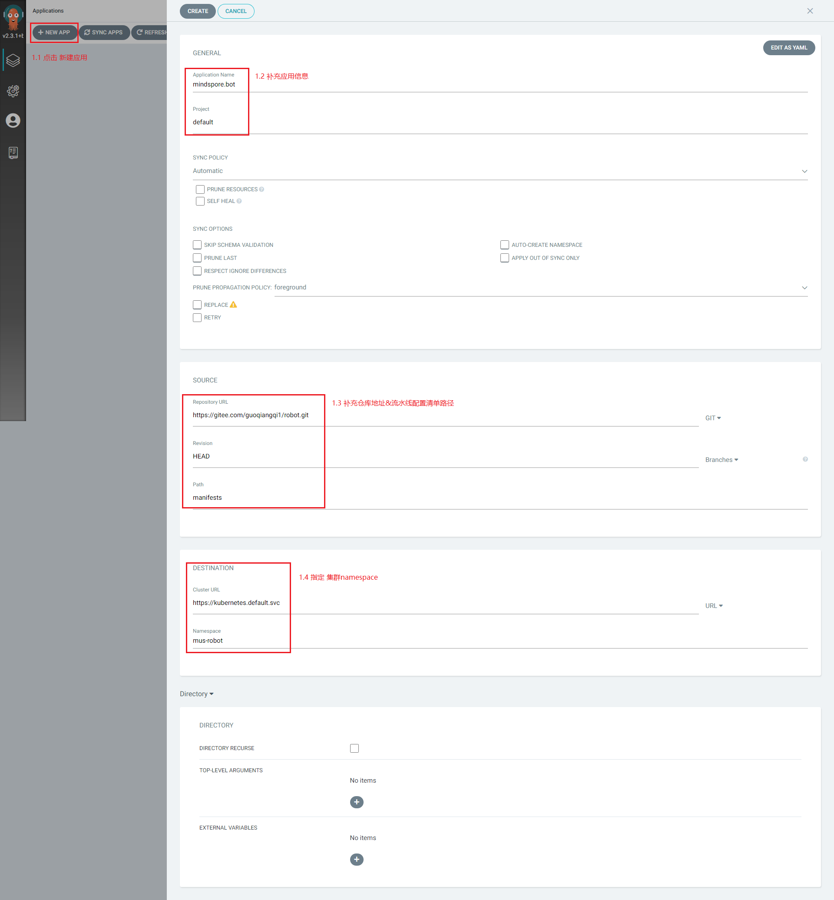
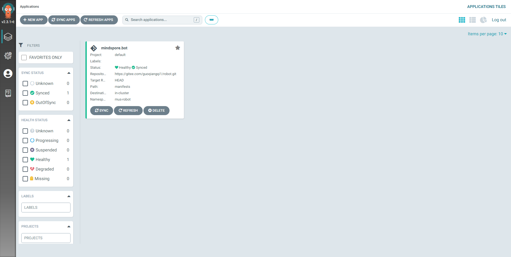
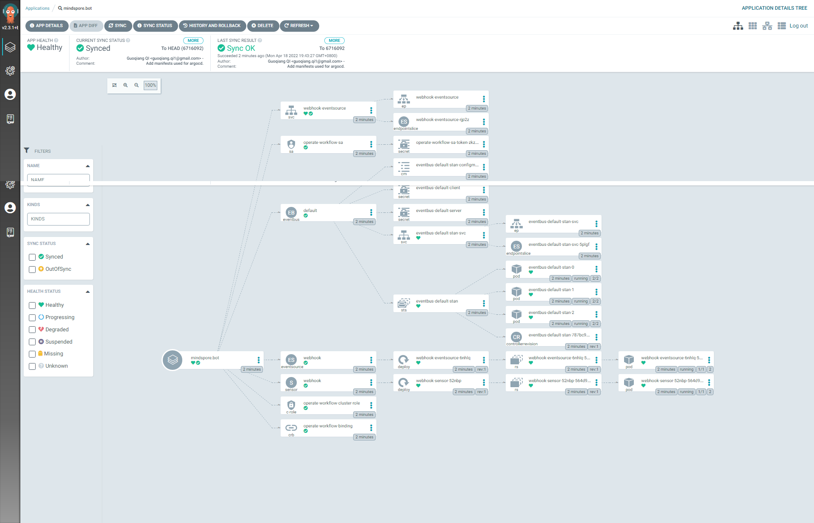
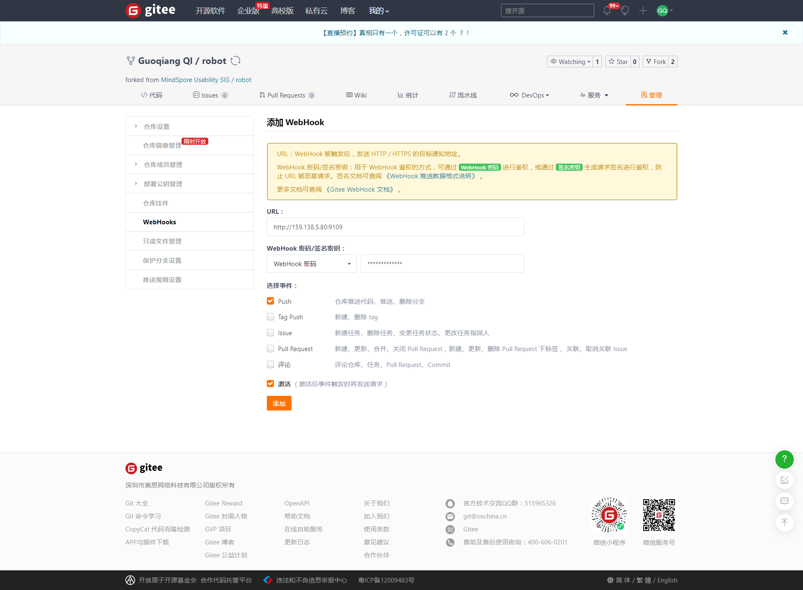
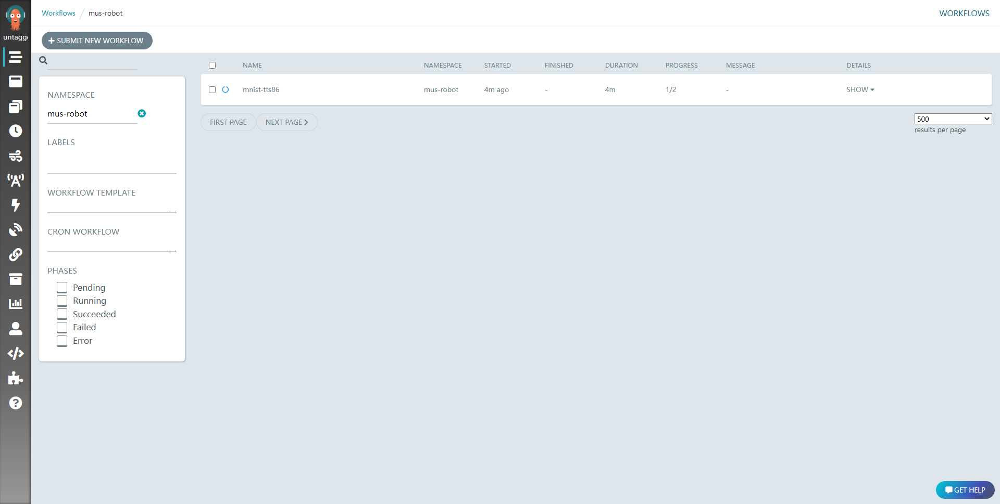
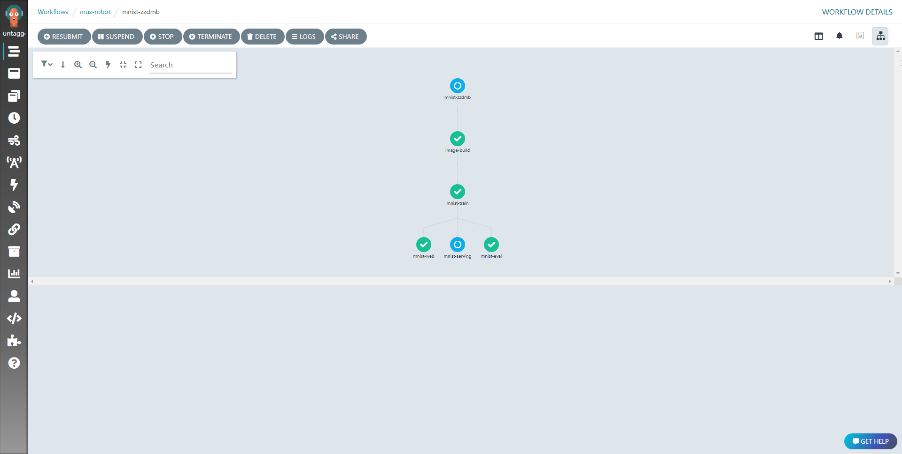
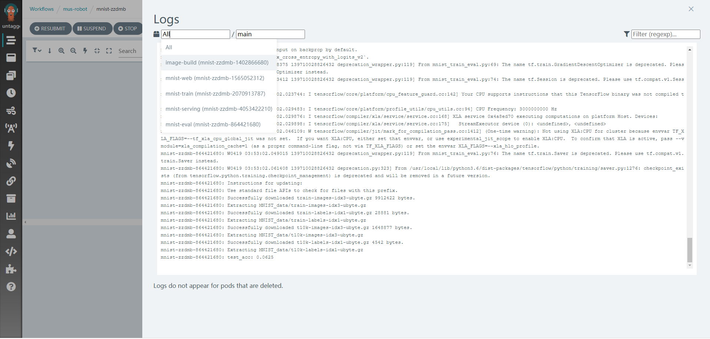

## Getting started guide
在开始前，请确保你已按照[MLops 安装指导](../../README.md)完成 Events, Workflows, CD等服务配置，可以使用`kubectl`指令进行检查：
```bash
# check argo controller
$ kubectl get pods -n argo
NAME                                  READY   STATUS    RESTARTS   AGE
argo-server-79bf45b5b7-j52gj          1/1     Running   0          21d
workflow-controller-9766476bb-9zjtw   1/1     Running   0          21d

# check argo-events controller
$ kubectl get pods -n argo-events
NAME                                      READY   STATUS    RESTARTS   AGE
eventbus-controller-5788c9d57-qmbds       1/1     Running   0          21d
eventsource-controller-68f8f5b798-p9prw   1/1     Running   0          21d
sensor-controller-f87f94df8-tl9j5         1/1     Running   0          21d

# check argocd controller
$ kubectl get pods -n argocd
NAME                                                READY   STATUS    RESTARTS   AGE
argocd-application-controller-0                     1/1     Running   0          21d
argocd-applicationset-controller-66689cbf4b-ndhqn   1/1     Running   0          21d
argocd-dex-server-7b896cc4f6-zs6w8                  1/1     Running   0          21d
argocd-notifications-controller-77866c485-px94g     1/1     Running   0          21d
argocd-redis-d486999b7-v8pll                        1/1     Running   0          21d
argocd-repo-server-bfd68b66f-t95tp                  1/1     Running   0          21d
argocd-server-66fff94644-bphgr                      1/1     Running   0          21d

```

### 创建应用
ArgoCD支持基于UI的操作，我们可以在对应页面快速创建流水线应用。实例中我们基于gitee仓库链接并指定配置清单路径配置应用，你同样可以配置 Github, Gitlab, Bitbucket等多个主流平台。对于私密仓库，你需要在配置前与仓库建立连接，可参考[argocd-user-guide/private-repositories/](https://argo-cd.readthedocs.io/en/stable/user-guide/private-repositories/)：
<div  align="center">   
 
</div>

应用创建成功后，在CD管理界面可以看到应用详细信息：
<div  align="center">   
 
 
</div>

### 配置webhook
Argo CD 每三分钟轮询一次 Git 存储库以检测清单的更改。为了消除轮询的延迟，可以将 API 服务器配置为接收 webhook 事件。Argo CD 支持来自 GitHub、GitLab、Bitbucket、Bitbucket Server 和 Gogs 的 Git webhook 通知，样例中我们基于Gitee平台配置：
   
<div  align="center">   
 
</div>

这里由于ArgoCD对于Gitee平台webhook格式不兼容，我们进行了适配，图片中设置的URL是[webhook-adapter](https://github.com/TECH4DX/webhook-adapter)服务地址，对于 Github,Gitlab等官方支持平台，URL设置可参考[Git Webhook Configuration](https://argo-cd.readthedocs.io/en/stable/operator-manual/webhook/)。

Webhook配置成功后，仓库每次更新将触发流水线同步更新。

到这里，我们已经完成了流水线部署和编排，你可以使用对于事件触发流水线运行。

### 触发流水线
我们的样例中部署了针对 webhook事件监听的流水线，你可以使用`curl`工具发送webhook请求触发流水线应用，相关配置参数也可在webhook bady 中指定：
```bash
$ curl -d '{"config":{"train-image-fullname":"guoqiangqi/robot-train:test", "serving-image-fullname":"guoqiangqi/robot-serving:test", "dockerhub-username":"guoqiangqi", "dockerhub-password":"xxxxxxxxx", "train-steps": "10", "serving-port":"8080"}}' -H "Content-Type: application/json" -X POST http://eventsource-service-ip:9100/webhook

```

触发流水线运行：

<div  align="center">   
 
 
</div>

相关日志也可快速查看：

<div  align="center">   
 
</div>