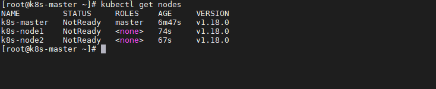

## Environment
- Ubuntu Version：18.04
- Docker: 20+
- k8s: 1.21.3

## Set hostname

Set hostname with command `hostnamectl set-hostname <hostname>`:
```bash
## set hostname on corresponding machine.
$ hostnamectl set-hostname k8s-master/k8s-nodeN
```

## System setting
Perform the operations on both the master and slave/workers nodes:  

- Shut down some system services
    ```bash
    # disabling the firewall
    $ ufw disable

    # disabling the selinux
    $ sudo apt install selinux-utils
    $ setenforce 0

    # disabling the swap partition
    $ swapoff -a
    $ sudo gedit /etc/fstab ## comment out the "swap" line
    ```
- Chain of bridged IPv4 traffic passed to iptables
    ```bash
    $ cat > /etc/sysctl.d/k8s.conf <<EOF
    net.bridge.bridge-nf-call-ip6tables = 1
    net.bridge.bridge-nf-call-iptables = 1
    net.ipv4.ip_forward = 1
    vm.swappiness = 0
    EOF
    $ sysctl --system #生效
    ```

## K8S setting 
The following operations on the master and slave nodes need to be executed：：
- Install `docker`:
    ```bash
    $ apt install docker.io -y
    ```
- Configure `k8s` resources:
    ```bash
    $ curl -s https://mirrors.aliyun.com/kubernetes/apt/doc/apt-key.gpg | sudo apt-key add -
    $ echo "deb https://mirrors.aliyun.com/kubernetes/apt/ kubernetes-xenial main" > /etc/apt/sources.list.d/kubernetes.list
    $ apt-get update
    ```
- Install `kubeadm`(initialize the cluster), `kubelet` (start pod)and `kubectl`(k8s command tool)
    ```bash
    $ apt install -y kubelet=1.21.3-00 kubeadm=1.21.3-00 kubectl=1.21.3-00
    ```
- Set startup and start the `kubelet`
    ```bash
    $ systemctl enable kubelet && systemctl start kubelet
    ```
The following operations on the master node need to be executed：
- Create and execute `k8s.s`:
    ```bash
    #!/bin/bash
    images=(
    kube-apiserver:v1.21.3
    kube-controller-manager:v1.21.3
    kube-scheduler:v1.21.3
    kube-proxy:v1.21.3
    pause:3.2
    etcd:3.4.13-0
    )
    for imageName in ${images[@]} ; do
    docker pull registry.cn-hangzhou.aliyuncs.com/google_containers/${imageName}
    docker tag registry.cn-hangzhou.aliyuncs.com/google_containers/${imageName} k8s.gcr.io/${imageName}
    docker rmi registry.cn-hangzhou.aliyuncs.com/google_containers/${imageName}
    done
    docker pull coredns/coredns:1.8.0
    docker tag coredns/coredns:1.8.0 registry.aliyuncs.com/google_containers/coredns:v1.8.0
    docker rmi coredns/coredns:1.8.0
    ```
- Initialize Master
    ```bash
    $ kubeadm init --image-repository=registry.aliyuncs.com/google_containers  --pod-network-cidr=10.244.0.0/16	 --service-cidr=10.96.0.0/12
    ``` 
- Record the sentence "join and execute on the slave node"
    ```bash
    $ kubeadm join 172.16.206.13:6443 --token 9pslv8.6tbrux0ksur0wgav --discovery-token-ca-cert-hash sha256:3709a3ce5a0ec81
    ```
    **NOTE:**  if there is no record, it can also be obtained by the following operations on the master node:：
    ```bash
    $ kubeadm token create --print-join-command
    ```
    The default token validity period is 24 hours. When it expires, the token cannot be used. At this time, you can use the following command to create a token:
    ```bash
    $ kubeadm token create --ttl 0
    ```

- Master node configuration `kubectl`:
    ```bash
    $ mkdir -p $HOME/.kube
    $ sudo cp -i /etc/kubernetes/admin.conf $HOME/.kube/config
    $ sudo chown $(id -u):$(id -g) $HOME/.kube/config
    ```

## Setup CNI network plugin
According to the prompt, use the `kubectl` tool on the Master node to view the node status:
```bash
$ kubectl get nodes
```


Deploy the `CNI` network plug-in on the Master node(May fail, if it fails, please download to local, then install):  

```bash
$ kubectl apply -f https://github.com/flannel-io/flannel/releases/latest/download/kube-flannel.yml
```
Use the `kubectl` tool on the Master node to view the node status again:
```bash
$ kubectl get nodes
```


## Fix Unhealthy status
After the cluster is deployed, when `kubectl` get cscommand is executed to check the running status of the components, the following errors may be reported:
```bash
$ kubectl get cs
Warning: v1 ComponentStatus is deprecated in v1.19+
NAME                 STATUS      MESSAGE                                                                                       ERROR
scheduler            Unhealthy   Get "http://127.0.0.1:10251/healthz": dial tcp 127.0.0.1:10251: connect: connection refused  
controller-manager   Unhealthy   Get "http://127.0.0.1:10252/healthz": dial tcp 127.0.0.1:10252: connect: connection refused  
etcd-0               Healthy     {"health":"true"}                                                                            
$ wget http://127.0.0.1:10251/healthz
--2020-11-14 00:10:51--  http://127.0.0.1:10251/healthz
Connecting to 127.0.0.1:10251... failed: Connection refused.
```
In this case，it is caused by the default port set by `kube-controller-manager.yaml` and `kube-scheduler.yaml` under `/etc/kubernetes/manifests/` which is 0，it need to use  # to comment out  `-–port=0` in the corresponding file:
```bash
# 1. kube-controller-manager.yaml文件修改：注释掉27行
# 2. kube-scheduler.yaml配置修改：注释掉19行,- --port=0
```
On the master node restart `kubelet`:
```bash
$ systemctl restart kubelet.service
```
Recheck，it is normal:
```bash
$ kubectl get cs
Warning: v1 ComponentStatus is deprecated in v1.19+
NAME                 STATUS    MESSAGE             ERROR
scheduler            Healthy   ok                 
controller-manager   Healthy   ok                 
etcd-0               Healthy   {"health":"true"}  
```

## Ingress-Nginx-Controller Install (Optional)
We can quickly complete the installation of the nginx-ingress-controller based on Helm. This installation will mainly be based on the official Helm Chart file and modify some configurations (mainly network settings).

- Add the nginx-ingress-controller repo
The following parts will be displayed depending on your Helm version.
    ```bash
    $ helm repo add ingress-nginx https://kubernetes.github.io/ingress-nginx
    $ helm repo update
    $ helm repo add ingress-nginx https://kubernetes.github.io/ingress-nginx
    $ helm search repo ingress-nginx
    NAME                            CHART VERSION   APP VERSION     DESCRIPTION                                       
    ingress-nginx/ingress-nginx     4.10.0          1.10.0          Ingress controller for Kubernetes using NGINX a...
    $ helm pull ingress-nginx/ingress-nginx --version 4.10.0
    ```

- Modify the values.yaml file
    ```bash
    # Modify the nodePort
    type: NodePort
    .........Omitted, there are two nodePorts to be modified here.......
    nodePorts:
    # -- Node port allocated for the external HTTP listener. If left empty, the service controller allocates one from the configured node port range.
    http: "80"
    # -- Node port allocated for the external HTTPS listener. If left empty, the service controller allocates one from the configured node port range.
    https: "443"

    # Modify hostNetwork and dnsPolicy (Optional)
    hostNetwork: true
    dnsPolicy: ClusterFirstWithHostNet

    # Configure the installation mode according to requirements: Deployment/DaemonSet
    kind: Deployment
    ```
  
- Install the ingress-nginx-controller
    ```bash
    In the ingress-nginx directory
    $ kubectl create ns ingress-nginx
    $ helm install ingress-nginx -n ingress-nginx .   # Install
    $ helm uninstall ingress-nginx -n ingress-nginx   # Uninstall
    ```

## Cert-Manager Install (Optional)
Cert-manager is an open - source cloud - native certificate management project used to automatically manage and issue TLS certificates from various sources in a Kubernetes cluster. It can issue certificates from a variety of supported sources, including Let’s Encrypt, HashiCorp Vault, Venafi, and private PKI. It ensures that certificates are valid and updated regularly and attempts to renew certificates at an appropriate time before expiration.

- Install cert-manager  
Cert - manager can be installed via Helm or directly using YAML files. The YAML files provided by Jetstack include all resources (CustomResourceDefinitions and the cert - manager, cainjector, and webhook components) in a single YAML manifest file.
    ```bash
    $ kubectl apply -f https://github.com/jetstack/cert-manager/releases/download/v1.4.0/cert-manager.yaml
    ```

- Install Issuer/ClusterIssuer  
Issuers/ClusterIssuers: They define which certificate authority (CA) to use for issuing certificates. The difference between Issuers and ClusterIssuers is that Issuers are namespace - level resources and can only issue certificates within their own namespace. ClusterIssuer is a cluster - level resource and can issue certificates in any namespace. Note that you need to generate an API token from the DNS service provider of the corresponding domain (here we use Cloudflare).
    ```yaml
    ---
    apiVersion: v1
    kind: Secret
    metadata:
    name: cloudflare-api-token-secret
    namespace: cert-manager
    type: Opaque
    stringData:
    api-token: xxxxxx
    ---
    apiVersion: cert-manager.io/v1
    kind: ClusterIssuer
    metadata:
    name: letsencrypt-dns01
    spec:
    acme:
        server: https://acme-v02.api.letsencrypt.org/directory
        privateKeySecretRef:
        name: letsencrypt-dns01
        solvers:
        - dns01:
            cloudflare:
            email: guoqiang.qi1@gmail.com
            apiTokenSecretRef:
                name: cloudflare-api-token-secret
                key: api-token
    ```

- Use Cert-Manager to Issue Certificates in Ingress
    ```yaml
    apiVersion: networking.k8s.io/v1
    kind: Ingress
    metadata:
    name: example-cert-manager
    annotations:
        kubernetes.io/ingress.class: nginx
        nginx.ingress.kubernetes.io/ssl-redirect: "true"
        cert-manager.io/cluster-issuer: letsencrypt-dns01
    spec:
    tls:
    - hosts:
        - your_domain_name.com
        secretName: example-tls
    rules:
    - host: your_domain_name.com
        http:
        paths:
        - path: /
            pathType: Prefix
            backend:
            service:
                name: example
                port:
                number: 80
    ```

- View the Issued Certificate
    ```bash
    $ kubectl get certificate
    $ kubectl get secret example-tls -o yaml
    ```

## NFS Install (Optional)
- Install server and client
    ```bash
    $ apt install nfs-kernel-server nfs-common
    ```
     `nfs-kernel-server` is the server, `nfs-common` is the client.

- Configure `nfs` shared directory
    create a shared directory under `$HOME` ，and export it in /etc/exports:
    ```bash
    $ mkdir nfs-share
    $ sudo vim /etc/exports 
    /home/user/nfs-share *(rw,sync,no_root_squash,no_subtree_check)
    ```
    The format is as follows:  
    | Shared | IP address that can access the shared directory (shared directory permission list) |
    |  ----  | ----  |
    
    Each field is parsed as follows:  
    `/home/user/nfs-share`: Drectory to share  
    `:` Scify the user ip that can access the shared directory , * stands for all users. 192.168.3. specify network segment. 192.168.3.29 specify ip  
    `rw`:Readable and writable, if you want to read only, you can specify `ro`.  
    `sync`:The files are written to memory and hard disk synchronously.  
    `async`:the files are temporarily stored in memory , be  written directly to the hard disk,rather than written directly to the hard disk.  
    `no_root_squash`:The user who logs in to the nfs host and uses the shared directory, if it is root, then he has root privileges for this shared directory! This item is "extremely unsafe", and it is not recommended for use!But if you need to write to the nfs directory on the client side， you have to configure no_root_squash. Convenience and safety can not have both.  
    `root_squash`：The user who logs in to the nfs host and uses the shared directory, if it is root, the user's authority will also become an anonymous user, and the permissions of this user will be compressed into an anonymous user, usually his UID and GID will become the identity of the system account nobody.  
    `subtree_check`:force nfs to check permissions on parent directories(default)   
    `no_subtree_check`：do not check parent directory permissions  

- After the configuration is complete, execute the following commands to export the shared directory， and restart the `nfs` service:

    ```bash
    $ sudo exportfs -a      
    $ sudo service nfs-kernel-server restart
    ```
    The server configuration is complete.

- The client mounts shared file system
    ```bash
    # nfs-share 共享文件系统挂载到 /mnt
    $ sudo mount nfs-server-ip:/home/user/nfs-share /mnt
    ```
